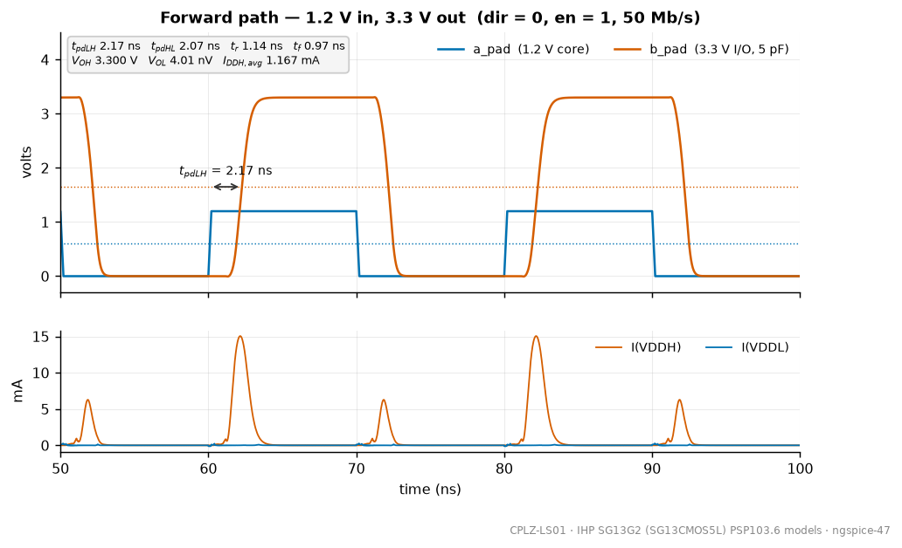
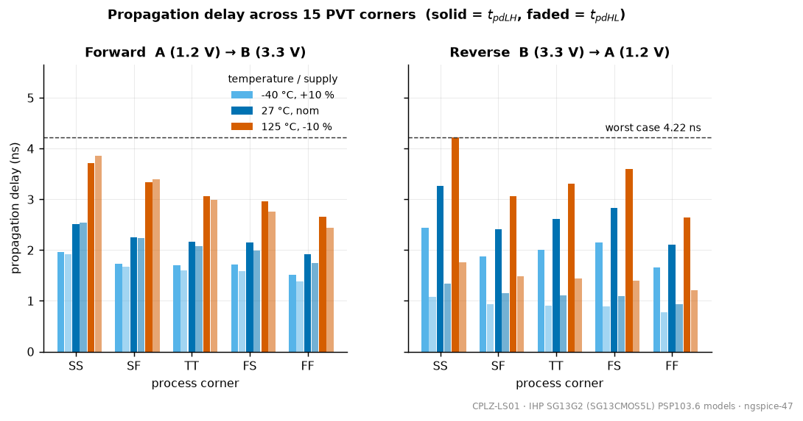

# 4-channel 1.2 V ↔ 3.3 V level shifter for ihp sg13g2

Bidirectional voltage-domain level shifter IP for the IHP SG13G2 (SG13CMOS5L) open-source PDK. Chipalooza Challenge #2 entry.

## Background

Multi-voltage SoCs need a bridge wherever a 1.2 V digital core meets 3.3 V I/O. This block does that translation. It has four independent channels, each set to shift up (1.2 V to 3.3 V) or down (3.3 V to 1.2 V) with a direction pin, plus an output enable (tri-state) and a low-power shutdown. It is built from standard 1.2 V and 3.3 V MOS devices only.

Commercial parts solve the same problem the same way. The TI `SN74LVC8T245` is the closest off-the-shelf equivalent: two supply rails, a `DIR` pin that picks the direction, an `OE` pin that puts both ports in high-impedance.[^ti245] The difference is that this one is a hard macro you drop inside a chip, not a package on a board.

---

# How it works

A 1.2 V core and a 3.3 V I/O ring cannot talk directly, for two separate reasons.

- **Going up is a logic problem.** A 1.2 V "high" is not high enough for 3.3 V logic to read as a high. Worse, it is not high enough to *switch off* a PMOS sitting on the 3.3 V rail — that PMOS only turns off when its gate gets within about 0.7 V of 3.3 V. So if you fed the 1.2 V signal straight into a 3.3 V inverter, the PMOS would never fully close and the gate would sit there burning DC current forever.
- **Going down is a reliability problem.** A 3.3 V "high" is easily high enough for 1.2 V logic to read. But 3.3 V on the gate of a thin-oxide 1.2 V transistor destroys it.

So the two directions need completely different circuits. That is why the block is not one circuit run backwards — it is two one-way paths sharing two pads.

## The big picture

```
              1.2 V side                     |                3.3 V side
                                             |
  a_pad -> SCHMLV -> INV -> MUX -> NAND+INV --+-> UP-SHIFT -> buf -> NAND --+
   ^       receiver          ^tm      ^en_up  |    LATCH             NOR ---+
   |                         |    (the rail is crossed here)                v
   |                         |               |                        HV DRIVER
   |                         |               |                            |
   |                         |               |                            +--> b_pad
   |                         |               |                            |
   |                         |               |                          200 ohm
   |                         |               |                            v
   +-- LV DRIVER <- NAND+NOR + <- NAND <- SCHMLV <- DOWN-SHIFT <- MUX <- HV INV
         ^en_a/en_ab           ^en_a  |            INVERTER      ^tm_h  receiver
                                      |
```

Only one path drives at a time. The control logic in the middle picks which,
and makes sure they are never both on together.

## Two rails, two kinds of transistor

The design uses only devices that already exist in the PDK.[^ihp] Nothing is hand-made.

| Device | L | Rated | Character |
|---|---|---|---|
| `sg13_lv_nmos` / `sg13_lv_pmos` | 0.13 µm | 1.2 V | fast, small, thin gate oxide — breaks at 3.3 V |
| `sg13_hv_nmos` / `sg13_hv_pmos` | 0.45 µm | 3.3 V | thick gate oxide, safe on the high rail, but slow and bigger |

Almost every decision in this block comes down to *which of those two you are
allowed to use at that node*, and what you do at the two places where a signal
has to cross.

## 1. Control logic and the dead-time trick

This part never touches 3.3 V. It takes the four control pins and produces two
enables: `en_up` turns on the 3.3 V driver, `en_a` turns on the 1.2 V driver.
Read the logic as: *drive the far side if the direction points that way, and
the output is enabled, and the block is enabled.*

The interesting part is the last two gates on each arm. `DLY2NS` is four
inverters with 0.35 pF hung on the internal nodes — a lumped delay of about
2 ns. The raw enable is then ANDed with that delayed copy of itself:

```
eur    ______|‾‾‾‾‾‾‾‾‾‾‾‾‾‾‾‾|______     raw
eud    __________|‾‾‾‾‾‾‾‾‾‾‾‾‾‾‾‾|__     same, 2 ns later
en_up  __________|‾‾‾‾‾‾‾‾‾‾‾‾|______     AND of the two
                 ^            ^
          turn-on waits    turn-off is
             2 ns           immediate
```

So every driver turns off fast and turns on slow. When `dir` flips, the old
driver is fully off well before the new one comes on. This is the same
break-before-make idea used in non-overlapping clock generators.[^baker]
Without it, both drivers would briefly be on at once and the 3.3 V driver would
dump current straight into the 1.2 V driver through the pads.

Measured dead time is **6.73 ns** one way and **6.80 ns** the other — the 2 ns
cell plus the gate delays around it.

`en_up`, `en` and `tm` are generated at 1.2 V but needed by 3.3 V gates, so each
goes through a copy of `CTRLLS` — the same up-shifter used for data, described
next. Each copy hands back both polarities, so the 3.3 V side never needs an
extra inverter to make a complement.

## 2. Shifting up — the hard direction

This is where most of the circuit lives.

```
                     vddh (3.3 V)
                 +--------+--------+
               MP1                MP2     HV pmos, W/L = 0.5/1.6 um
              gate=y             gate=x   cross-coupled, deliberately weak
                 |                 |
            x ---+--           ----+--- y --> [buffers] --> z_h
                 |                 |
               MN3                MN4     HV nmos, gate tied to 1.2 V
                 | n1              | n2   (cascode shield)
               MN1                MN2     LV nmos, W/L = 2.0/0.13 um
            gate=a_t          gate=a_nb   (the actual 1.2 V input pair)
                 |                 |      MN5 also hangs on y, gate=enb_h
                vss               vss
```

Three things are stacked here.

**The cross-coupled PMOS pair is a latch.** Nodes `x` and `y` are always
opposite: whichever one gets pulled down turns the *other* PMOS on, which pulls
the other node up to a full 3.3 V. There is no resistor and no bias current — it
is a bistable pair that gets pushed from one state to the other. This is the
standard textbook level converter,[^rabaey] and the same differential idea as
cascode voltage switch logic.[^cvsl]

**The catch is that it is a fight.** To flip the latch, a 1.2 V-driven NMOS leg
has to beat a 3.3 V PMOS that is currently holding its node high. That only
works if the NMOS wins, which is why `MP1`/`MP2` are 0.5 µm wide and 1.6 µm long
— deliberately feeble — against a 2.0 µm minimum-length input pair. This
contention is the well-known weakness of the conventional cross-coupled
shifter: it makes the cell slow, ratio-dependent, and sensitive to corners where
the PMOS is fast and the NMOS slow. A large body of work exists on getting
around it, from cutting the contention path with a switch,[^koo] to pulsed
limited-contention control,[^lc2] to replacing the latch outright with a current
mirror.[^wilson] For a 1.2 V input the ratio approach is still comfortable; it
only gets genuinely painful when the low rail drops near threshold.[^wooters]

**The cascode shield is `MN3`/`MN4`,** gates tied permanently to 1.2 V. Their
sources can never rise above roughly 1.2 V − V_th, about half a volt, so the
thin-oxide devices below never see more than that on their drains even though
the node above swings to 3.3 V. This is the standard way to let low-voltage
devices work inside a high-voltage domain — the same self-biased cascode /
stacked-device trick used to run I/O and output drivers above their rated
supply.[^annema][^serneels][^ker] The closest published match to what this
block does is Wang et al., who build exactly this: a 1.0 V → 3.3 V up-shifter
with 3.3 V NMOS clamps protecting the 1.0 V switches.[^wang]

One smaller detail: `a_t` and `a_nb` come from a NAND followed by an inverter,
so the complement arrives one inverter delay *before* the true signal. One leg
lets go slightly before the other one pulls — less fighting, less crowbar
current through the latch.

**Holding it still when the block is off.** `MN5` is a small HV NMOS from node
`y` to ground with `enb_h` on its gate. Without it the latch would be left in
whatever state it happened to be in, and the buffer behind it could sit at a
half-open point and leak. With it, the whole 3.3 V side settles into a defined
state — that is what makes the **7.51 nW** per-channel shutdown number possible.

**The output driver.** `z_h` (the full 3.3 V copy of the data) goes to a NAND
and a NOR: `pg = NAND(z_h, en_b_h)` drives the PMOS gate, `ng = NOR(z_h,
enb_b_h)` drives the NMOS gate. Enabled, both track `z_h` and the driver is a
normal push-pull inverter. Disabled, `pg` is forced high and `ng` low, both
output devices turn off, and `b_pad` goes high-impedance. Driving the two output
devices from separate gates is the usual way to build a tri-state pad
driver.[^weste] The devices are large — 96 µm of HV PMOS against 48 µm of HV
NMOS, roughly 2:1 for the slower carrier — because they have to move 5 pF in
about a nanosecond.

## 3. Shifting down — easy, but not free

No latch here and no contention problem, because 3.3 V already reads as a high
to 1.2 V logic. You just need an inverter running on the 1.2 V rail. The only
constraint is that its gates see 3.3 V, so the down-shift inverter is built from
**HV devices powered from the LV rail**: thick oxide, so 3.3 V on the gate is
fine, but the drain only ever swings 0 to 1.2 V. Wang et al. describe the same
arrangement — 3.3 V NMOS used as both pull-up and pull-down on a 1.0 V supply
with a 0–3.3 V gate swing.[^wang]

The price shows up in the waveforms. When the input to that inverter is low, its
HV PMOS has only 1.2 V of gate drive on a device whose threshold is around
0.7 V — barely on. So the rise is slow, and the measurements say so: reverse
rise time **2.15 ns** against **1.14 ns** forward, on the same load. The
`SCHMLV` right after it exists to square that slow edge back up, because a slow
edge through a plain inverter picks up noise and can double-switch.[^schmitt]

The 200 Ω series resistor at the pad limits current into the receiver on an
overshoot and keeps the receiver's gate capacitance off the pad node. It is not
a substitute for a real ESD structure.

### Where the reverse hysteresis went

The reverse path has only 49 mV of DC input hysteresis against 283 mV forward.
The architecture explains it directly:

- On the **forward** path the Schmitt trigger is the *first thing on the pad*.
  Its hysteresis is the channel's input hysteresis. You get all 283 mV.
- On the **reverse** path the first thing on the pad is a **plain HV inverter**,
  sized 1.5 µm PMOS to 1.0 µm NMOS, which trips near 1.5 V — exactly the
  measured V_IL / V_IH of 1443 mV / 1493 mV. The Schmitt sits two stages
  downstream, by which point the signal is already digital, so it barely moves
  the input threshold at all. The 49 mV is just what leaks back through.

Whichever block sits first on the pad owns the channel's input threshold. The
fix is structural, not a resize: the pad-facing HV receiver needs to *be* a
Schmitt trigger — an HV version of `SCHMLV` — rather than have one bolted on
behind it.

## 4. Test mode

Setting `tm = 1` does two things at once. In the control logic it forces *both*
direction arms enabled together. In the datapath, two muxes reroute: the LV mux
feeds the reverse path's recovered output `z_l` back into the forward path's
input, and the HV mux feeds the forward path's output `z_h` into the reverse
path's input.

That closes a loop — up-shift, down-shift, back to the start — with an odd
number of inversions, so it oscillates. Measured **316.8 MHz**. `DIV16`, four
transmission-gate flip-flops[^c2mos] wired as toggles, divides that by exactly
16 and brings it out on `ring_div`, so you measure roughly 19.8 MHz on an
ordinary pin instead of trying to probe 317 MHz. Using an on-chip ring
oscillator as a speed and process monitor is a standard technique.[^ring]

One honest limitation: the loop taps `z_h` *before* the big output driver, so it
measures the translation core and tells you nothing about the output stage or
the load.

## Which block owns which number

| Measured | Comes from |
|---|---|
| Forward t_pd 2.17 / 2.07 ns | latch flip time, two HV buffer stages, then the big driver into 5 pF |
| Reverse t_pd 2.61 / 1.12 ns | asymmetric because the HV PMOS on the 1.2 V rail is weak pulling up and strong pulling down |
| Reverse t_rise 2.15 ns | same weak HV PMOS running on 1.2 V |
| Full-rail V_OH / V_OL at every corner | the latch is regenerative — it has no in-between state to settle at |
| 7.51 nW shutdown | `MN5` parking the latch, plus both drivers tri-stated |
| 283 mV vs 49 mV hysteresis | Schmitt at the pad forward; plain inverter at the pad reverse |
| 6.7–6.8 ns dead time | the `DLY2NS` cell plus the gate delay around it |
| 4.22 ns worst case, SS / 125 C / −10 % | the latch fight gets harder when the PMOS is fast and the NMOS is slow |

---

## Simulation results

| | Forward 1.2 V to 3.3 V | Reverse 3.3 V to 1.2 V |
|---|---|---|
| t_pd (TT, 27 C, 5 pF) | 2.17 / 2.07 ns | 2.61 / 1.12 ns |
| worst case over 15 PVT corners | 3.86 ns | 4.22 ns |
| output levels | full rail, all corners | full rail, all corners |




Full method, decks and figures are in [`sim/README.md`](sim/README.md). Numbers
come from ngspice-47 against the real PSP103.6 device models,[^psp] not the
placeholder models in the xschem testbench sheet.

Remaining issue: the reverse path has only 49 mV of DC input hysteresis
against 283 mV forward.

## What I would change next

1. **Make the reverse pad receiver a Schmitt trigger.** This is the one real deficiency in the block. Everything else is fine.
2. **Power down the idle receiver.** Right now the reverse receiver chain keeps toggling while the forward path drives `b_pad` — it is watching our own output. Same on the LV side. Gating those costs nothing in speed.
3. **Revisit the latch under corner pressure.** At SS / 125 C the ratioed fight is what sets worst-case delay. A limited-contention variant[^lc2] buys margin at the cost of more devices.
4. **Put a real load on it.** All of this is schematic-level into a lumped 5 pF. Layout parasitics and a package model will move the delays.

---

## Related work

**Bidirectional translation as a product.** The board-level equivalents split
into two families: direction-pin parts like the `SN74LVC8T245`,[^ti245] which is
what this block imitates, and auto-sensing parts that infer direction from the
bus. TI's application notes lay out the trade-off between them and are the
clearest short statement of what a translator has to guarantee.[^scea040] The
auto-sensing idea goes back to Schutte's one-MOSFET-per-line I²C shifter, which
gets bidirectionality for free out of the open-drain bus rather than out of a
direction pin.[^an97055] On-chip, the closest published work is Hossain and
Savidis, who integrate level shifters into a bidirectional I/O cell and compare
current-mirror, cross-coupled and single-ended shifter cores inside it.[^hossain]

**Up-conversion topologies.** The cross-coupled PMOS latch used here descends
from cascode voltage switch logic[^cvsl] and is the version in the standard
textbooks.[^rabaey] Essentially all of the subsequent literature is about its
one flaw — the input pair has to overpower the PMOS keeper. Koo et al. cut the
contention path with a switch element;[^koo] Kim et al. use a pulsed control so
contention exists only briefly;[^lc2] Lütkemeier and Rückert replace the
latch with a Wilson current mirror, trading static current for
robustness;[^wilson] Wooters et al. combine several methods to convert all the
way from 188 mV.[^wooters] Those last three matter mostly when the low rail is
near or below threshold. At 1.2 V into 3.3 V the plain ratioed latch is still
the right answer, which is why it is what is here.

**Surviving the high rail with low-voltage devices.** Two threads. Annema et al.
and Serneels et al. show how stacked and self-biased cascode devices let a
process run I/O well above its rated supply;[^annema][^serneels] Ker et al.
survey the mixed-voltage I/O buffer problem as a whole — stacked NMOS, gate
tracking, floating N-well — which is the same reliability question this block
answers with the `MN3`/`MN4` clamps.[^ker] Wang et al. is the direct precedent:
a 1.0 V ↔ 3.3 V pair of shifters in 0.13 µm using exactly this clamp for the
up path and exactly this HV-devices-on-the-low-rail inverter for the down
path.[^wang] SG13G2 makes it easier than any of these, because a real 3.3 V
thick-oxide device already exists in the process — no zero-V_th tricks needed.

**The supporting cells.** The Schmitt trigger is the classic six-transistor
topology, whose hysteresis comes entirely from the two feedback devices.[^schmitt]
The flip-flop is a transmission-gate master–slave pair in the clocked-CMOS
lineage.[^c2mos] The tri-state output driver with separate pull-up and pull-down
gate drives is standard I/O practice.[^weste] The dead-time generator is a
non-overlapping clock generator by another name.[^baker] And the ring-oscillator
plus divider in test mode is the usual on-chip speed monitor.[^ring]

**Gap.** Almost all of the level-shifter literature above is about *one*
direction, usually up, usually as an isolated cell. Very little of it deals with
a shared pad, a direction pin, break-before-make between two drivers, or
tri-state — which is where most of the transistors in this block actually go.
Hossain and Savidis[^hossain] is the nearest thing to prior art on the whole
cell, and even that does not cover the dead-time or shutdown behaviour.

## References

[^ti245]: Texas Instruments, *SN74LVC8T245 8-Bit Dual-Supply Bus Transceiver With Configurable Voltage Translation and 3-State Outputs*, datasheet. <https://www.ti.com/product/SN74LVC8T245>

[^scea040]: Texas Instruments, *Basics of Voltage-Level Translation*, application report SCEA040, Feb. 2008. <https://www.ti.com/lit/an/scea040/scea040.pdf> — see also SCEA043 (TXB-type) and SCEA044 (TXS-type), Mar./Jun. 2010, for the auto-sensing alternatives.

[^an97055]: H. Schutte, *Bi-directional level shifter for I²C-bus and other systems*, Philips Semiconductors application note AN97055, Aug. 1997. One MOSFET per line, direction inferred from the bus rather than from a pin.

[^hossain]: M. S. Hossain and I. Savidis, "Bi-directional input/output circuits with integrated level shifters for near-threshold computing," in *Proc. IEEE Int. Midwest Symp. Circuits and Systems (MWSCAS)*, 2017. Conversion ranges 0.38–1.2 V and 0.45–3.3 V; compares current-mirror, cross-coupled and single-ended shifter cores inside one bidirectional I/O cell.

[^cvsl]: L. G. Heller, W. R. Griffin, J. W. Davis, and N. G. Thoma, "Cascode voltage switch logic: A differential CMOS logic family," in *ISSCC Dig. Tech. Papers*, 1984, pp. 16–17. Origin of the cross-coupled differential structure.

[^rabaey]: J. M. Rabaey, A. Chandrakasan, and B. Nikolić, *Digital Integrated Circuits: A Design Perspective*, 2nd ed. Prentice Hall, 2003. Level converters and ratioed logic.

[^wang]: W.-T. Wang, M.-D. Ker, M.-C. Chiang, and C.-H. Chen, "Level shifters for high-speed 1-V to 3.3-V interfaces in a 0.13-µm Cu-interconnection/low-k CMOS technology," in *Proc. Int. Symp. VLSI Technology, Systems, and Applications (VLSI-TSA)*, Apr. 2001, pp. 307–310. The closest published match to this block: HV NMOS clamps protecting the LV switches on the way up, HV devices on the low rail on the way down.

[^koo]: K.-H. Koo, J.-H. Seo, M.-L. Ko, and J.-W. Kim, "A new level-up shifter for high speed and wide range interface in ultra deep sub-micron," in *Proc. IEEE Int. Symp. Circuits and Systems (ISCAS)*, 2005. Adds a switch element that cuts the contention path once the transition completes.

[^lc2]: Y. Kim, D. Sylvester, and D. Blaauw, "LC2: Limited contention level converter for robust wide-range voltage conversion," in *Symp. VLSI Circuits Dig.*, Jun. 2011. Pulsed control so contention exists only during the transition; 0.3 V to 2.5 V in 130 nm.

[^wilson]: S. Lütkemeier and U. Rückert, "A subthreshold to above-threshold level shifter comprising a Wilson current mirror," *IEEE Trans. Circuits Syst. II*, vol. 57, no. 9, pp. 721–724, Sep. 2010. Replaces the ratioed latch entirely.

[^wooters]: S. N. Wooters, B. H. Calhoun, and T. N. Blalock, "An energy-efficient subthreshold level converter in 130-nm CMOS," *IEEE Trans. Circuits Syst. II*, vol. 57, no. 4, pp. 290–294, Apr. 2010. Clear statement of why the conventional cell fails as the low rail drops.

[^annema]: A.-J. Annema, G. J. G. M. Geelen, and P. C. de Jong, "5.5-V I/O in a 2.5-V 0.25-µm CMOS technology," *IEEE J. Solid-State Circuits*, vol. 36, no. 3, pp. 528–538, Mar. 2001. Running I/O above the rated supply with stacked devices.

[^serneels]: B. Serneels, T. Piessens, M. Steyaert, and W. Dehaene, "A high-voltage output driver in a 2.5-V 0.25-µm CMOS technology," *IEEE J. Solid-State Circuits*, vol. 40, no. 3, pp. 576–583, Mar. 2005. Self-biased cascode output stage at three times the nominal supply.

[^ker]: M.-D. Ker, S.-L. Chen, and C.-S. Tsai, "Overview and design of mixed-voltage I/O buffers with low-voltage thin-oxide CMOS transistors," *IEEE Trans. Circuits Syst. I*, vol. 53, no. 9, pp. 1934–1945, Sep. 2006. Survey of stacked-NMOS, gate-tracking and floating-N-well techniques.

[^schmitt]: I. M. Filanovsky and H. Baltes, "CMOS Schmitt trigger design," *IEEE Trans. Circuits Syst. I*, vol. 41, no. 1, pp. 46–49, Jan. 1994. Where the six-transistor topology and its hysteresis equations come from.

[^weste]: N. H. E. Weste and D. M. Harris, *CMOS VLSI Design: A Circuits and Systems Perspective*, 4th ed. Addison-Wesley, 2010. I/O and pad drivers; tri-state predrivers; transmission-gate flip-flops.

[^baker]: R. J. Baker, *CMOS: Circuit Design, Layout, and Simulation*. Wiley-IEEE Press. Non-overlapping clock generation — the same delay-and-AND trick used here for dead time.

[^c2mos]: Y. Suzuki, K. Odagawa, and T. Abe, "Clocked CMOS calculator circuitry," *IEEE J. Solid-State Circuits*, vol. 8, no. 6, pp. 462–469, Dec. 1973. The clocked-CMOS latch that `DFFLV` descends from.

[^ring]: M. Bhushan, A. Gattiker, M. B. Ketchen, and K. K. Das, "Ring oscillators for CMOS process tuning and variability control," *IEEE Trans. Semicond. Manuf.*, vol. 19, no. 1, pp. 10–18, Feb. 2006. On-chip ring oscillators as speed and process monitors.

[^ihp]: IHP Open Source PDK (SG13G2 / SG13CMOS5L), Apache 2.0. <https://github.com/IHP-GmbH/IHP-Open-PDK> — 0.13 µm BiCMOS with two gate oxides, thin for 1.2 V logic and thick for 3.3 V. See `SG13G2_os_process_spec.pdf` in that repo.

[^psp]: G. Gildenblat *et al.*, "PSP: An advanced surface-potential-based MOSFET model for circuit simulation," *IEEE Trans. Electron Devices*, vol. 53, no. 9, pp. 1979–1993, Sep. 2006. The model family behind the SG13G2 corner libraries used for every number here.
