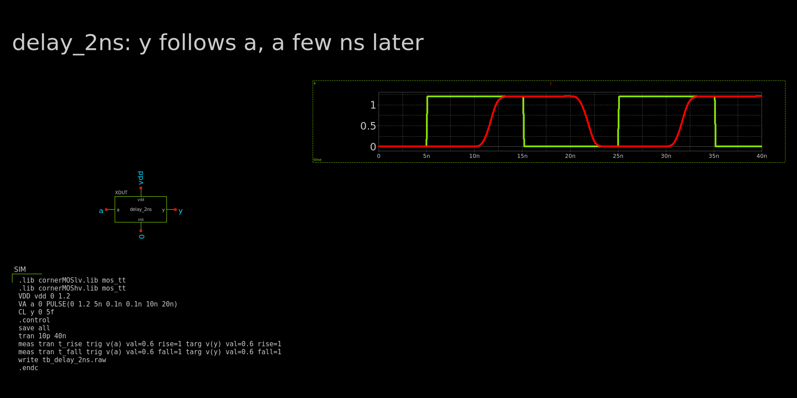
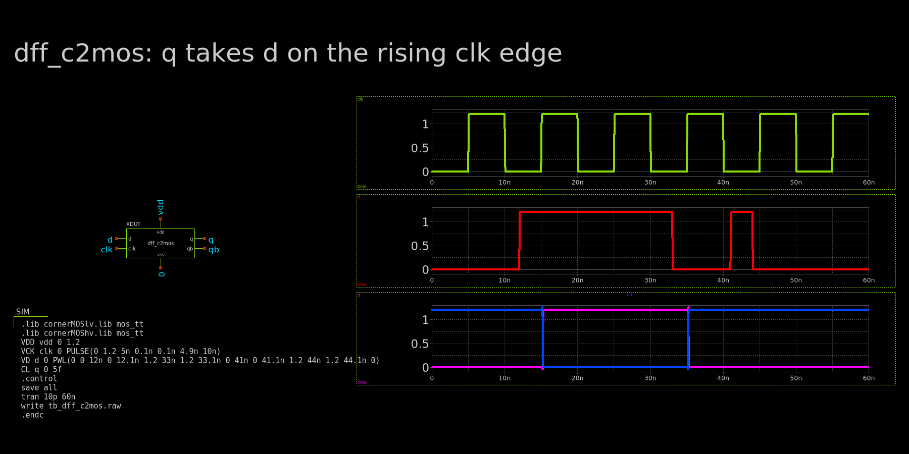
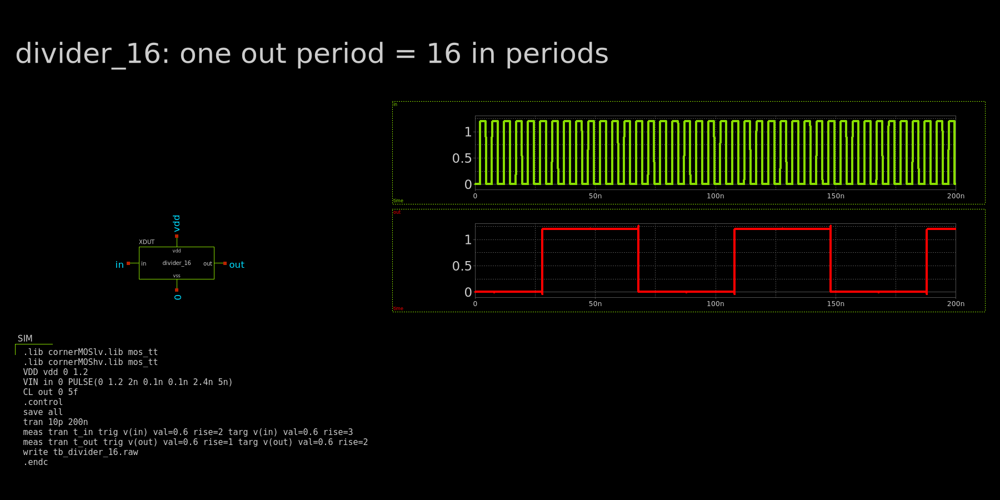
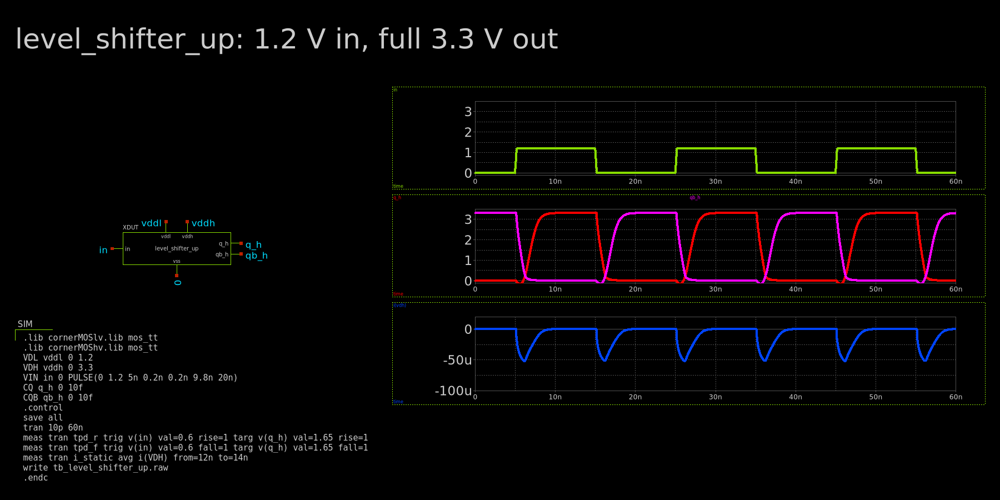
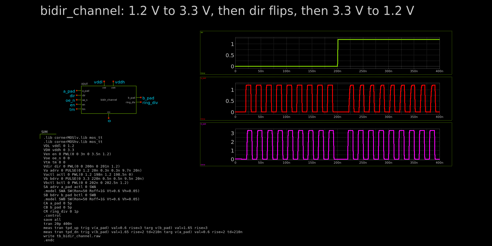
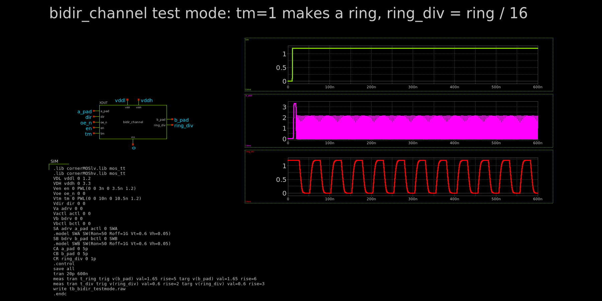

# Verification

Each block has its own testbench here. All of them use the real IHP models
(`mos_tt`, 27 °C). The screenshots come straight from xschem, and the graphs
load the sim results by themselves.

## delay_2ns

*`a` (green) goes in, `y` (red) comes out. `y` follows `a` about 6.6 ns later
on both edges.*

This checks the delay that the channel uses for break-before-make. `y` never
flips before `a`, so a driver can't turn on early. Note: with the real models
it is ~6.6 ns, not 2 ns.

## dff_c2mos

*`clk` on top, `d` in the middle, `q` (pink) and `qb` (blue) on the bottom.*

`q` only changes on a rising `clk` edge (15 ns and 35 ns). The short `d` pulse
at 41–44 ns sits between two edges, so `q` ignores it. `qb` is always the
opposite of `q`. So it is an edge-triggered flip-flop, not a latch.

## divider_16

*200 MHz `in` on top, `out` on the bottom.*

One `out` period is 80 ns, which is 16 `in` periods (16 × 5 ns). So the four
flip-flops divide by 16.

## level_shifter_up

*`in` (0–1.2 V) on top, `q_h` (red) and `qb_h` (pink) in the middle, 3.3 V
supply current on the bottom.*

A 1.2 V input gives a full 0–3.3 V output on both sides. Delay is 1.9 ns
(rise) and 0.5 ns (fall). Current only flows during a switch. In between it is
about 12 nA, so the latch doesn't burn DC current.

## bidir_channel: both directions

*`dir` on top, `a_pad` (1.2 V side) in the middle, `b_pad` (3.3 V side) on
the bottom. 5 pF on each pad.*

For the first 200 ns `dir = 0`: we drive `a_pad` and `b_pad` copies it at
3.3 V (2.3 ns delay). Then `dir` flips, we drive `b_pad`, and `a_pad` copies
it at 1.2 V (2.6 ns delay). Both pads stay quiet around the flip, so the two
drivers never fight.

## bidir_channel: test mode

*`tm` on top, `b_pad` in the middle, `ring_div` on the bottom.*

With `tm = 1` the channel loops back on itself and rings. The ring period is
3.2 ns (~317 MHz). `ring_div` has a 50.5 ns period, which is 16 × 3.2 ns, so
the divider works inside the channel too. `b_pad` doesn't reach a full 3.3 V
here because 5 pF is a lot to swing at that speed, but the loop keeps going.

## Area estimate

No layout yet, so these are rough numbers from the netlists
(`python3 verification/area.py xschem/simulation/tb_bidir_channel.spice`).

| Block | LV FETs | HV FETs | Caps | Est. area |
|---|---:|---:|---:|---:|
| `delay_2ns` | 8 | 0 | 1.2 pF | ~170 µm² |
| `dff_c2mos` | 24 | 0 | – | ~65 µm² |
| `divider_16` | 100 | 0 | – | ~280 µm² |
| `level_shifter_up` | 4 | 4 | – | ~50 µm² |
| `bidir_channel` | 216 | 49 | 2.4 pF | ~2,200 µm² |
| **4 channels** | | | | **~9,000 µm² (~95 × 95 µm)** |

How: each FET gets a box of (W + contacts) × (L + source/drain), times `m`.
Add them up, then ×2.5 for wells, spacing and wires. Caps are counted as MOS
caps at ~8 fF/µm². About half of the channel area is the big pad drivers and the
caps in the two `delay_2ns` cells.
